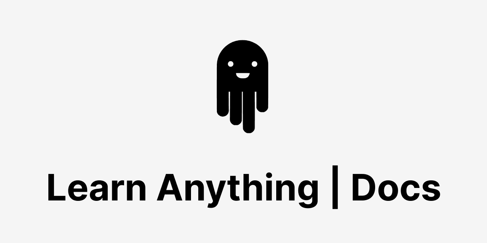

#### A project to organize world's knowledge, explore relations and curate learning paths.

## Contributing

Please read our [contribution guidelines](CONTRIBUTING.md#readme).

## Curated Lists

We also manage curation of various lists. Feel free to [explore and improve them](https://github.com/learn-anything/curated-lists#readme).

## Support

This project is built by the community, for the community and our goals is to create the best platform possible for exploring new topics and finding valuable resources. There are no advertisements or sponsored content in the website, we rely on donations which can be done through our [Patreon page](https://www.patreon.com/learnanything).

Thank you, to all the people who contributed to this project and vision.

## Team

- [@nikitavoloboev](https://github.com/nikitavoloboev) - developer
- [@johnletey](https://github.com/johnletey) - developer
- [@simonpeterdebbarma](https://github.com/simonpeterdebbarma) - developer
- [@nglgzz](https://github.com/nglgzz) - developer
- [_Contributors_](https://github.com/learn-anything/docs/graphs/contributors)

## License

